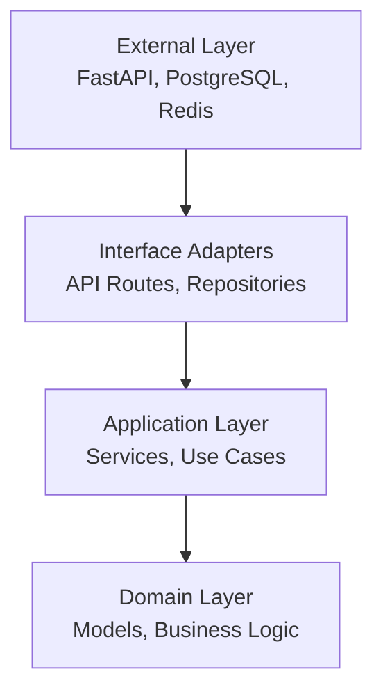
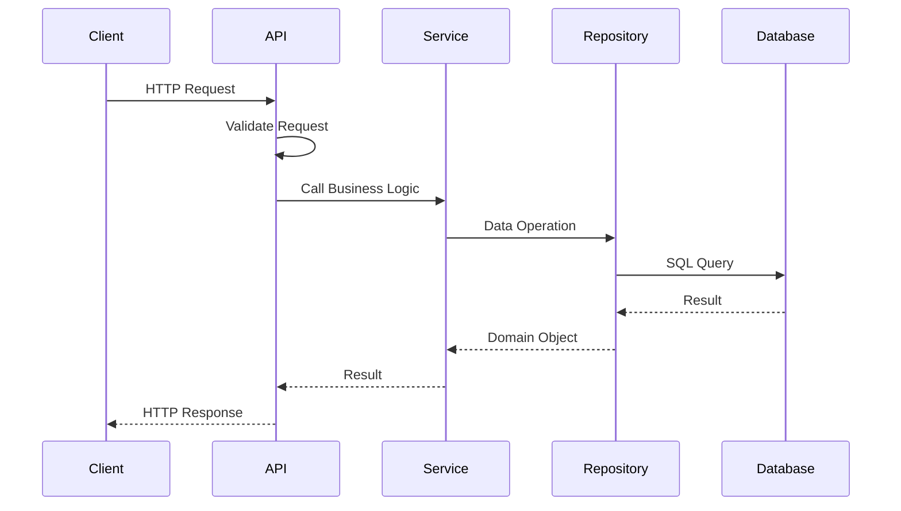

# Architecture Overview

The FastAPI Backend Template follows modern software architecture principles to create a maintainable, scalable, and testable application. This overview explains the key architectural decisions and patterns used throughout the project.

## Design Principles

### Clean Architecture

The project implements Clean Architecture principles with clear separation between:

- **External Layer** - Frameworks, databases, web interfaces
- **Interface Adapters** - Controllers, presenters, gateways
- **Application Layer** - Use cases and application business rules
- **Domain Layer** - Enterprise business rules and entities

### Dependency Inversion

Dependencies flow inward toward the business logic, with external concerns depending on abstractions rather than concrete implementations.



## Project Structure

```
app/
├── api/                 # 🌐 External Layer - API endpoints
│   └── v1/
│       ├── auth.py      # Authentication endpoints
│       ├── users.py     # User management endpoints
│       └── health.py    # Health check endpoints
├── cmd/                 # 🚀 Application entry point
│   └── main.py
├── core/                # ⚙️ Core configuration
│   ├── settings.py      # Application settings
│   ├── database.py      # Database setup
│   └── telemetry.py     # Observability setup
├── dependencies/        # 🔌 Dependency injection
├── middlewares/         # 🛡️ Request/response processing
├── models/              # 🗄️ Domain Layer - Data models
├── repositories/        # 📊 Interface Adapters - Data access
├── schemas/             # 📝 Data transfer objects
├── services/            # 🏗️ Application Layer - Business logic
└── tasks/               # ⚡ Background tasks
```

## Layer Responsibilities

### API Layer (`app/api/`)

**Purpose**: Handle HTTP requests and responses

**Responsibilities**:

- Route definition and HTTP verb mapping
- Request validation using Pydantic schemas
- Response serialization
- Authentication and authorization
- Error handling and status code management

```python
@router.post("/users/", response_model=UserResponse)
async def create_user(
    user_data: UserCreate,
    user_service: UserService = Depends(get_user_service)
) -> UserResponse:
    return await user_service.create_user(user_data)
```

### Service Layer (`app/services/`)

**Purpose**: Implement business logic and orchestrate operations

**Responsibilities**:

- Business rule enforcement
- Use case implementation
- Cross-cutting concerns (logging, metrics)
- Transaction management
- Integration with external services

```python
class UserService:
    def __init__(self, user_repo: UserRepository):
        self.user_repo = user_repo

    async def create_user(self, user_data: UserCreate) -> User:
        # Business logic
        if await self.user_repo.get_by_email(user_data.email):
            raise UserAlreadyExistsError()

        # Hash password, create user, etc.
        return await self.user_repo.create(user_data)
```

### Repository Layer (`app/repositories/`)

**Purpose**: Abstract data access and provide a consistent interface

**Responsibilities**:

- Database query implementation
- Data mapping between models and schemas
- Transaction handling
- Query optimization

```python
class UserRepository:
    def __init__(self, db: AsyncSession):
        self.db = db

    async def get_by_email(self, email: str) -> User | None:
        result = await self.db.execute(
            select(User).where(User.email == email)
        )
        return result.scalar_one_or_none()
```

### Model Layer (`app/models/`)

**Purpose**: Define domain entities and database schema

**Responsibilities**:

- Domain entity definition
- Database table structure
- Relationships and constraints
- Business logic methods on entities

```python
class User(Base):
    __tablename__ = "users"

    id: Mapped[int] = mapped_column(primary_key=True)
    email: Mapped[str] = mapped_column(unique=True, index=True)
    hashed_password: Mapped[str]
    created_at: Mapped[datetime] = mapped_column(default=func.now())

    def verify_password(self, password: str) -> bool:
        return verify_password(password, self.hashed_password)
```

## Core Components

### Dependency Injection

The application uses FastAPI's dependency injection system to manage dependencies and enable testability:

```python
# app/dependencies/database.py
async def get_db() -> AsyncGenerator[AsyncSession, None]:
    async with async_session() as session:
        yield session

# app/dependencies/services.py
def get_user_service(
    db: AsyncSession = Depends(get_db)
) -> UserService:
    return UserService(UserRepository(db))
```

### Configuration Management

Settings are managed through Pydantic Settings with environment variable support:

```python
class Settings(BaseSettings):
    app_name: str = "FastAPI Backend Template"
    database_url: str
    redis_url: str
    secret_key: str

    class Config:
        env_file = ".env"
```

### Error Handling

Centralized error handling with custom exceptions and HTTP status mapping:

```python
class AppException(Exception):
    status_code: int = 500
    detail: str = "Internal server error"

class UserNotFoundError(AppException):
    status_code = 404
    detail = "User not found"
```

## Data Flow

### Request Processing Flow



### Key Benefits

1. **Testability** - Each layer can be tested independently
2. **Maintainability** - Clear separation of concerns
3. **Flexibility** - Easy to swap implementations
4. **Scalability** - Modular design supports growth

## Integration Patterns

### Database Integration

- **SQLAlchemy 2.0** with async support
- **Repository pattern** for data access abstraction
- **Alembic** for database migrations
- **Connection pooling** for performance

### Caching Strategy

- **Redis** for session storage and caching
- **Repository-level** caching for frequently accessed data
- **TTL-based** cache invalidation

### Background Tasks

- **Celery** for distributed task processing
- **Redis** as message broker
- **Task retries** and error handling
- **Monitoring** with Flower

### Observability

- **OpenTelemetry** for distributed tracing
- **Structured logging** with correlation IDs
- **Metrics collection** for monitoring
- **Health checks** for system status

## Security Architecture

### Authentication & Authorization

- **JWT tokens** for stateless authentication
- **Role-based access control** (RBAC)
- **Password hashing** with bcrypt
- **Token refresh** mechanism

### Input Validation

- **Pydantic schemas** for request validation
- **SQL injection** prevention through ORM
- **CORS middleware** for cross-origin requests

## Next Steps

Explore specific architectural components:

- [Clean Architecture](clean-architecture.md) - Detailed layer explanation
- [Database Design](database.md) - Schema and migrations
- [Authentication](authentication.md) - Security implementation
